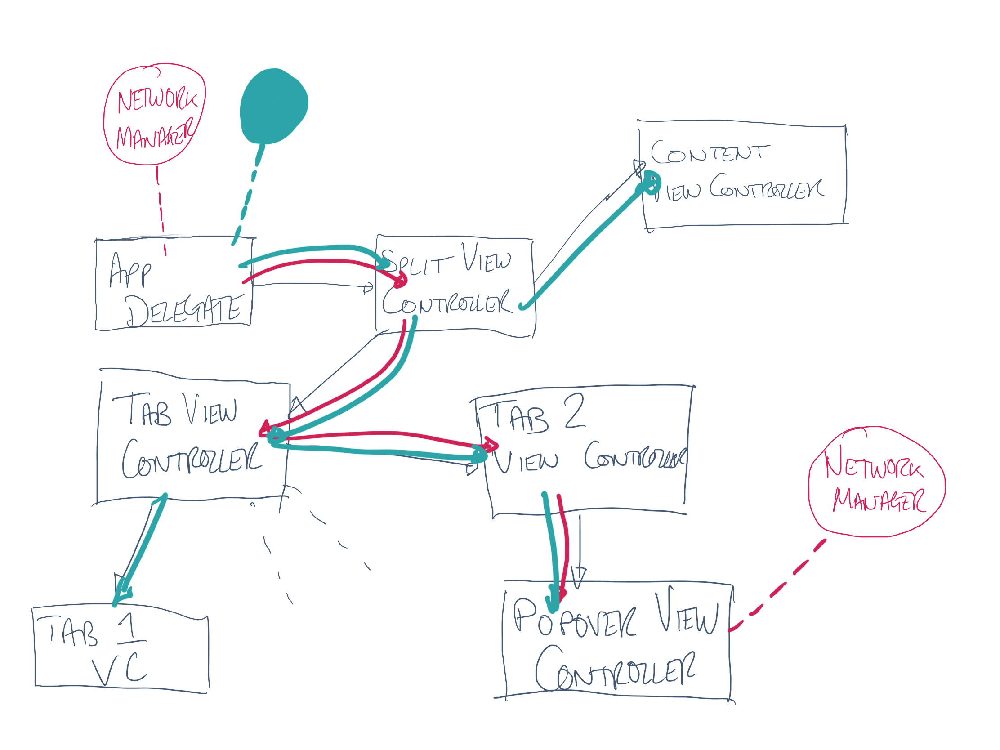

#[fit] DIY DI
#[fit] _sam : @iwantmyrealname_
#[fit] __github.com/sammyd/iOSCon2018_DIYDI__
---

#[fit] single
#[fit] tons

---

#[fit] __single__
#[fit] tons

---

#[fit] __one__
#[fit] instance

---

#[fit] __network__
#[fit] controller

---

#[fit] __file__
#[fit] access

---

#[fit] __animation__
#[fit] engine

---

#[fit] what's the
#[fit] __problem?__

---

#[fit] __global__
#[fit] access

---

```swift
class Manager {
  static let shared = Manager()
  private init()
}
```

---

```swift
class Manager {
  static let shared = Manager()
  private init()
}


let manager = Manager.shared
```

---

#[fit] __bad__

---

#[fit] __hidden__
#[fit] state

---

#[fit] __hard__ to
#[fit] test

---

#[fit] _possible_
#[fit] solution...

---

#[fit] don't allow
#[fit] __global__
#[fit] access

---

#[fit] _give_ objects
#[fit] what they
#[fit] __need__

---

#[fit] __inject__
#[fit] their
#[fit] __dependencies__

---

#[fit] __hierarchy__
#[fit] problem

---


---


---


---



---


---


---

#[fit] _alternative_

---

#[fit] a __way__
#[fit] to __find__
#[fit] __dependencies__

---


---

#[fit] _contained_
#[fit] facsimile for
#[fit] __global state__

---

#[fit] dependency
#[fit] __container__

---

```swift
protocol NetworkManagerProvider {
  var networkManager: NetworkManager { get }
}
```

---

```swift
protocol NetworkManagerProvider {
  var networkManager: NetworkManager { get }
}

protocol DataStoreProvider {
  var dataStore: DataStore { get }
}
```

---

```swift
protocol NetworkManagerProvider {
  var networkManager: NetworkManager { get }
}

protocol DataStoreProvider {
  var dataStore: DataStore { get }
}

protocol AnimationEngineProvider {
  var animationEngine: AnimationEngine { get }
}
```

---

```swift
class DependencyContainer: NetworkProvider,
                           DataStoreProvider,
                           AnimationEngineProvider {
  ...
}
```

---

```swift
class MyViewController {
  typealias DependencyProvider = NetworkManagerProvider &
                                 DataStoreProvider
  ...
}
```

---

```swift
class MyViewController {
  typealias DependencyProvider = NetworkManagerProvider &
                                 DataStoreProvider
  private let provider: DependencyProvider

  ...
}
```

---

```swift
class MyViewController {
  typealias DependencyProvider = NetworkManagerProvider &
                                 DataStoreProvider
  private let provider: DependencyProvider

  private lazy var dataStore = provider.dataStore
  private lazy var networkManager = provider.networkManager

  ...
}
```

---

```swift
class MyViewController {
  typealias DependencyProvider = NetworkManagerProvider &
                                 DataStoreProvider
  private let provider: DependencyProvider

  private lazy var dataStore = provider.dataStore
  private lazy var networkManager = provider.networkManager

  init(dependencyProvider: DependencyProvider) {
    self.dependencyProvider = dependencyProvider
  }
}
```

---

#[fit] by no means
#[fit] __perfect__

---

#[fit] but
#[fit] __better__
#[fit] than before

---

#[fit] DI/IoC popular
#[fit] with the
#[fit] __grownups__

---

#[fit] consider it
#[fit] when you're
#[fit] __struggling__

---

#[fit] @iwantmyrealname
#[fit] __github.com/sammyd/iOSCon2018_DIYDI__

